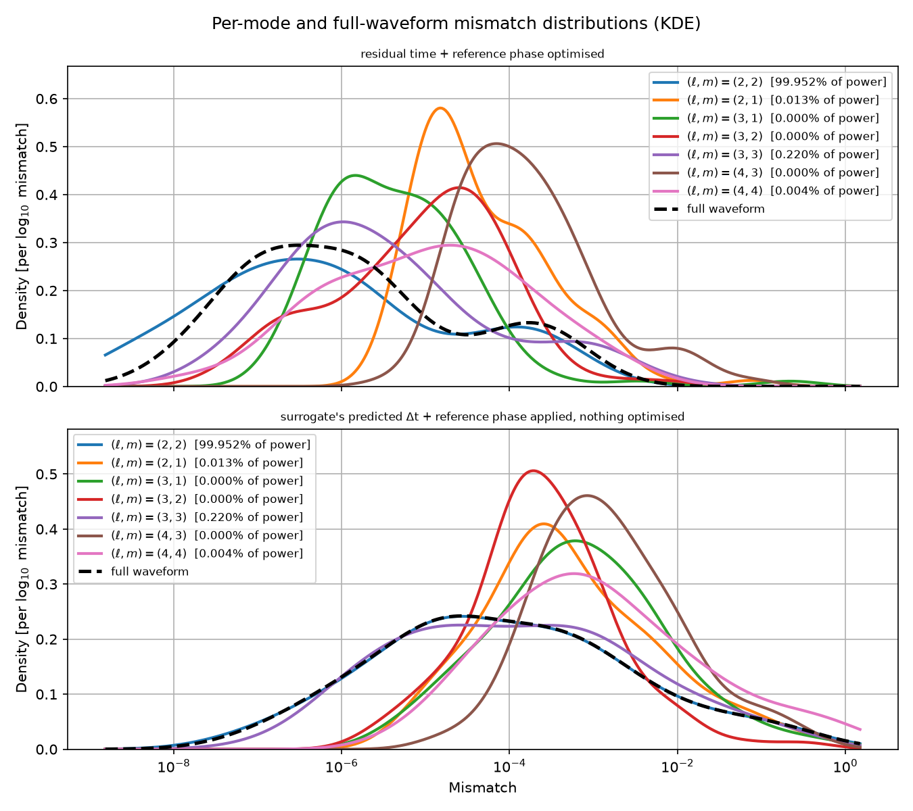
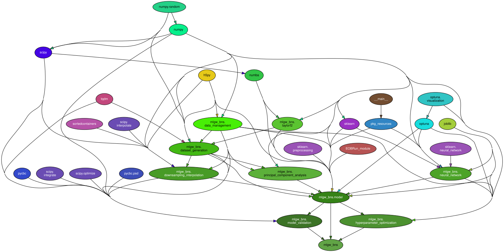

[](https://github.com/jacopok/mlgw_bns/actions/workflows/ci.yaml)
[](https://mlgw-bns.readthedocs.io/en/latest/?badge=latest)
[](https://badge.fury.io/py/mlgw-bns)
[](https://github.com/psf/black)
[](https://coveralls.io/github/jacopok/mlgw_bns?branch=master)
[](https://pepy.tech/project/mlgw-bns)

# Machine Learning for Gravitational Waves from Binary Neutron Star mergers

This package's purpose is to speed up the generation of template gravitational waveforms for binary neutron star mergers by training a machine learning model on a dataset of waveforms generated with some physically-motivated surrogate.

It is able to reconstruct them with mismatches lower than 1/10000,
with as little as 1000 training waveforms; 
the accuracy then steadily improves as more training waveforms are used.

Currently, the only model used for training is [`TEOBResumS`](http://arxiv.org/abs/1806.01772),
but it is planned to introduce the possibility to use others.

The model shipped with the package covers the $(2,2)$, $(2,1)$, $(3,1)$,
$(3,2)$, $(3,3)$, $(4,3)$ and $(4,4)$ spherical-harmonic modes.
Below are the per-mode and full-waveform mismatch distributions against
the underlying `TEOBResumS` waveforms: with the residual time shift and
reference phase optimized (top), and with only the surrogate's own
predicted alignment applied (bottom):



The documentation can be found [here](https://mlgw-bns.readthedocs.io/en/latest).

<!--  -->

## Installation

To install the package, use
```bash
pip install mlgw-bns
```

For more details see [the documentation](https://mlgw-bns.readthedocs.io/en/latest/usage_guides/install.html).

## Changelog

Changes across versions are documented in the [CHANGELOG](https://github.com/jacopok/mlgw_bns/blob/master/CHANGELOG.md).

## Reference

The reference paper is [Tissino, Carullo, Breschi, Gamba, Schmidt & Bernuzzi, "Combining effective-one-body accuracy and reduced-order-quadrature speed for binary neutron star merger parameter estimation with machine learning"](https://arxiv.org/abs/2210.15684),
published in Physical Review D 107, 084037 (2023),
[doi:10.1103/PhysRevD.107.084037](https://doi.org/10.1103/PhysRevD.107.084037).